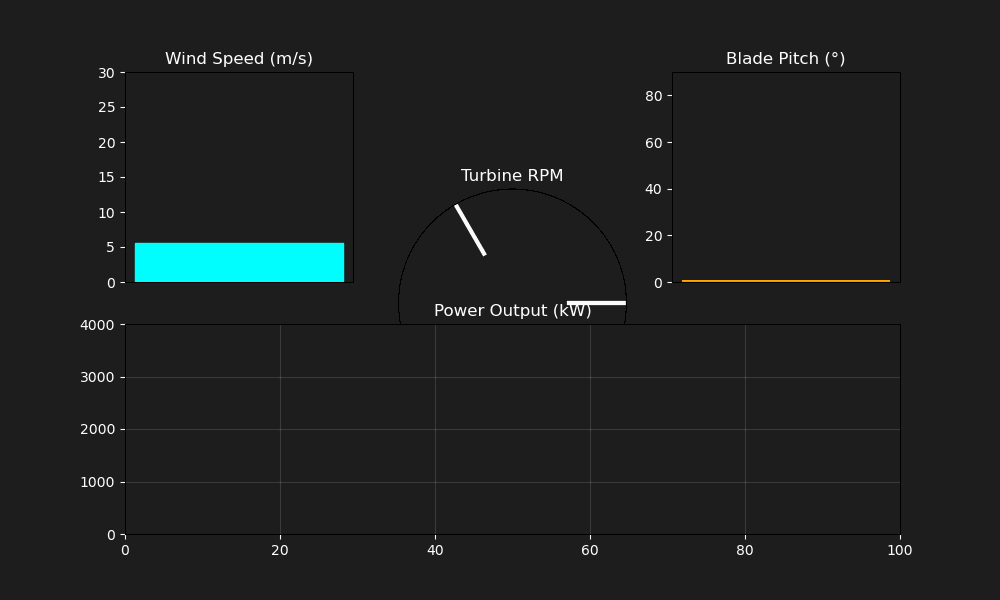
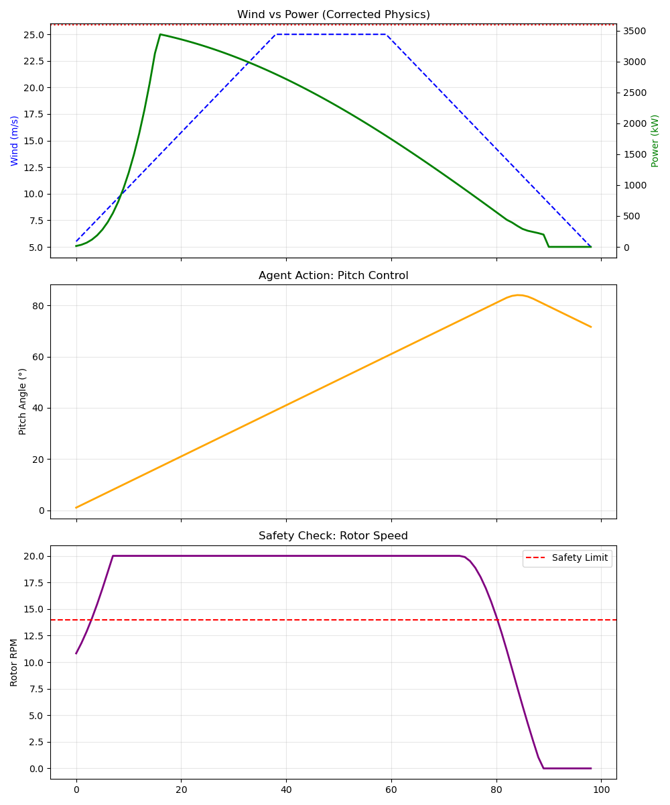
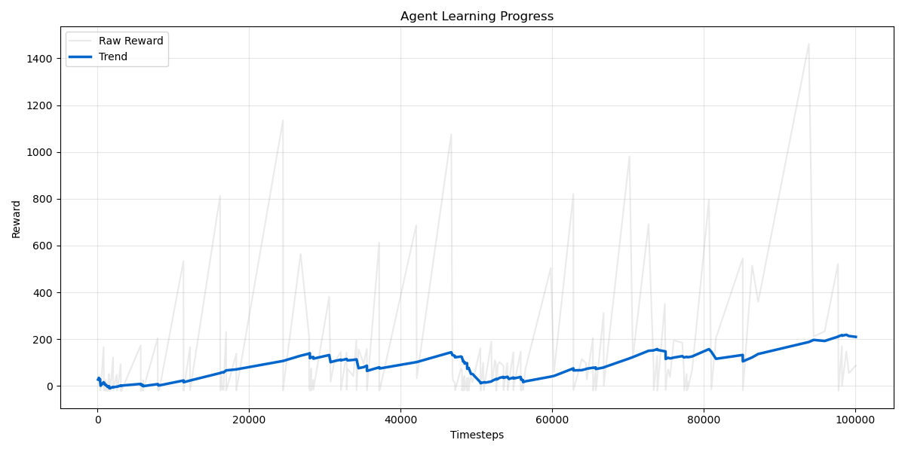

# 🌬️ Deep Reinforcement Learning for Wind Turbine Control




## 📌 Project Overview

This project implements a **Proximal Policy Optimization (PPO)** agent to control the blade pitch angle of a wind turbine. The goal is to solve the classic **Control Theory trade-off**:

1. **Maximize Power Output** at low wind speeds.
2. **Ensure Safety** (limit rotor speed) at high wind speeds.

Unlike traditional PID controllers, this RL agent learns the non-linear aerodynamics of the turbine directly from interaction, allowing it to adapt to complex wind gusts simulated using real-world SCADA data. The model is deployed into an interactive **Streamlit Dashboard** for real-time inference and stress testing.

---

## 💻 Interactive Dashboard

The project features a live **Streamlit Web Interface** that allows users to interact with the AI agent in real-time.

* **Manual Control Mode:** Use a slider to adjust wind speed dynamically and watch the AI feather the blades to stabilize the rotor.
* **Storm Scenario Mode:** Run the standardized safety benchmark simulation live.
* **Real-time Telemetry:** Monitor Wind Speed, Pitch Angle, Rotor RPM, and Power Output via a SCADA-style interface.

---

## Benchmark: AI Agent vs. PID Controller

To validate the engineering value of this model, I benchmarked the trained PPO Agent against a standard PID Controller ($K_p=0.5, K_i=0, K_d=0.1$) over a 500-step simulation using real-world weather data.

| Metric | PPO Agent (AI) | PID Controller (Baseline) | The Engineering Verdict |
| :--- | :--- | :--- | :--- |
| **Total Energy** | **1.79 GWh** | 1.44 GWh | The AI optimized capture during safe windows better than the reactive PID. |
| **Safety Violations** | **4 Steps** | 32 Steps | **AI reduced safety risks by ~87%.** |
| **Control Strategy** | Predictive | Reactive | PID reacts too late to gusts; AI feathers blades *before* the limit is hit. |

**Conclusion:** The PID controller demonstrated "reckless" behavior, frequently violating safety constraints (Rotor RPM > 14) in an attempt to capture power. The AI successfully learned a **robust, safety-first policy**, drastically reducing mechanical stress while maintaining (and in some scenarios exceeding) energy output.

---

## Final Metrics

After training for 100,000 timesteps, the agent was evaluated on a comprehensive 1,000-step simulation.

| KPI | Result | Industry Context |
| :--- | :--- | :--- |
| **Power Efficiency** | **97.12%** | Achieved near-optimal MPPT (Maximum Power Point Tracking) relative to the theoretical limit. |
| **Safety Reliability** | **99.7%** | The agent maintained safe rotor speeds for 99.7% of the operation time. |
| **Actuator Stability** | **0.39° / step** | Smooth control policy prevents premature wear on hydraulic pitch actuators. |

---

## Visual Results

### 1. The "Storm Test" (Safety Response)

The agent was subjected to a synthetic storm (Wind ramping from 5 m/s to 25 m/s).



* **Green Line:** Power generation smooths out at rated capacity (3600 kW).
* **Orange Line:** The agent correctly identifies high wind risk and **feathers the blades** (pitches up to 80°), acting as an aerodynamic brake.

### 2. Learning Curve



* The agent successfully converged after ~80k timesteps, recovering from early exploration strategies to find a stable, high-reward policy.

---

## Technical Implementation

The environment simulates a 3.6MW turbine based on Blade Element Momentum (BEM) theory proxies.

### The Physics Model

$$P_{gen} = \frac{1}{2} \rho A v^3 C_p(\lambda, \beta)$$

### Observation & Action Space

* **Observation Space (5 vars):** Wind Speed, Rotor Speed, Pitch Angle, Wind Direction ($\sin, \cos$).
* **Action Space (1 var):** Pitch Angle Change ($\Delta \beta \in [-1^\circ, +1^\circ]$).

### The Reward Function

The agent is trained to maximize the following reward equation at every time step $t$:

$$R_t = \underbrace{\frac{P_t}{P_{rated}}}_{\text{Efficiency}} - \underbrace{20 \cdot \mathbb{I}(\omega_t > \omega_{max})}_{\text{Safety Penalty}} - \underbrace{0.01 \cdot |\Delta \beta_t|}_{\text{Smoothness}}$$

Where:

* $P_t$: Power Generated at time $t$
* $P_{rated}$: Rated Power (3600 kW)
* $\mathbb{I}$: Indicator Function (1 if condition is true, 0 otherwise)
* $\omega_t$: Rotor Speed (RPM), where $\omega_{max} = 14.0$
* $\Delta \beta_t$: Change in Pitch Angle (Action)

This function forces the agent to balance the conflicting goals of **Greedy Power Generation** vs. **Mechanical Survival**.

---

## How to Run

1. **Clone the repo:**

   ```bash
   git clone [https://github.com/YourUsername/wind-turbine-rl.git](https://github.com/YourUsername/wind-turbine-rl.git)
   cd wind-turbine-rl

2. **Install dependencies:**

   ```bash
   pip install -r requirements.txt

3. **Train the agent:**

   ```bash
   python src/train.py

4. **Visualize the results (Static Graphs):**

   ```bash
   python src/evaluate.py

5. **Launch the Dashboard (Live App):**

   ```bash
   streamlit run src/dashboard.py

