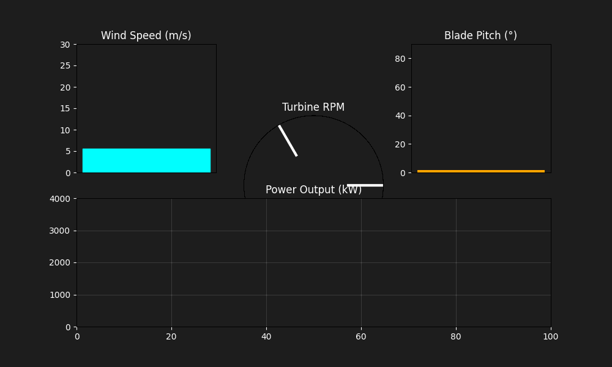
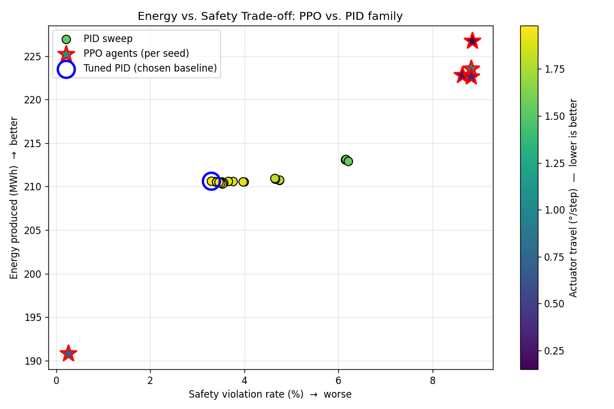
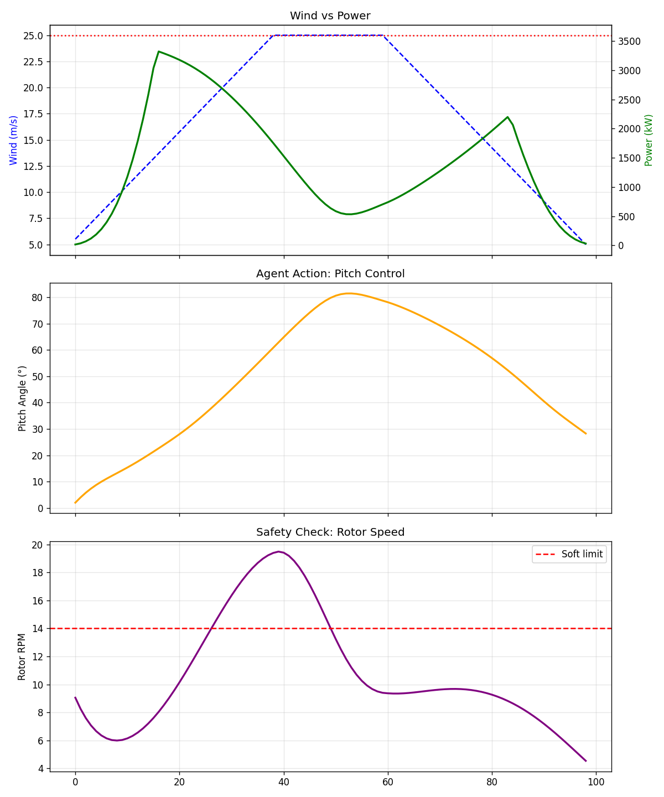
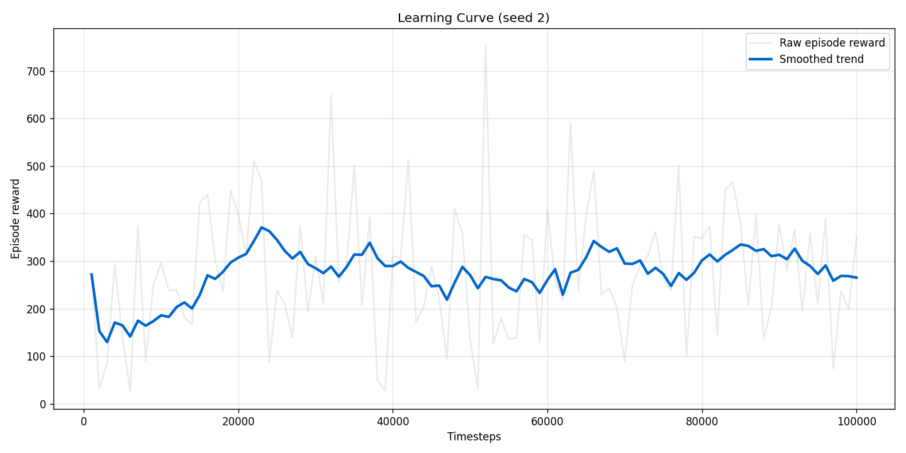

# 🌬️ Reinforcement Learning for Wind-Turbine Pitch Control


<!-- Add once pushed to GitHub:  -->



## Overview

This project trains a **Proximal Policy Optimization (PPO)** agent to control the
blade-pitch angle of a wind turbine, framed as a **multi-objective control
problem**: the controller must trade off three competing goals at every step —

1. **Energy capture** (don't feather away power you could harvest),
2. **Safety** (keep rotor speed under a soft limit), and
3. **Actuator wear** (minimise pitch-bearing movement).

The agent is benchmarked against a **fairly tuned PID baseline** (selected by a
gain sweep, not a strawman) and evaluated across **5 random seeds × 8 wind
windows** with **mean ± std** reporting. It is deployed in an interactive
**Streamlit dashboard** for live inference.

> **Honesty note (read this):** the environment is a *simplified, control-oriented
> simulation*, **not** a validated aeroelastic model. See
> [Methods & Limitations](#methods--limitations). The point of this project is a
> clean, reproducible RL *engineering pipeline* and an honest multi-objective
> comparison — not a physically calibrated turbine model.

---

## Tech Stack

* **Environment:** Custom `Gymnasium` env — damped first-order rotor model + feathering capture proxy, with training-time **domain randomisation** over wind.
* **Algorithm:** PPO (Stable-Baselines3) with `VecNormalize` observation/return scaling.
* **Data:** [Wind Turbine SCADA Dataset (Kaggle)](https://www.kaggle.com/datasets/berkerisen/wind-turbine-scada-dataset) — cleaned of sensor faults/curtailment (see `Notebooks/eda.ipynb`) and used as the wind sequence.
* **Evaluation:** multi-objective, **5 seeds × 8 wind windows**, tuned-PID baseline, Pareto analysis.
* **Reproducibility:** single `config.yaml`, pinned `requirements.txt`, fixed seeds, `pytest` suite + CI, no hardcoded paths.

---

## Results

Every controller is scored across **8 evenly-spaced wind windows** spanning the
full dataset (1,000 steps each), with identical metric accounting — so the
numbers reflect many weather conditions, not one lucky slice. Each controller's
score is averaged over windows; the RL row is then **mean ± std across 5
independently trained seeds**.

<!-- RESULTS_TABLE -->
| Metric | PPO Agent (mean ± std, N=5) | Tuned PID Baseline | Notes |
| :--- | :--- | :--- | :--- |
| Energy produced (MWh) | **217.3 ± 13.3** | 210.6 | Higher = more capture |
| Safety violation rate (%) | 7.1 ± 3.4 | **3.3** | Lower = safer (rotor over soft limit) |
| Actuator travel (°/step) | **0.49 ± 0.34** | 1.93 | Lower = less pitch-bearing wear |
| Power capture efficiency (%) | **93.3 ± 4.2** | 92.3 | Generated / theoretical |

*Tuned PID:* kp=1.0, ki=0.0, kd=1.0, target=13.0 RPM — the best-energy config at
the lowest violation count from a 24-point gain sweep (not a strawman).
<!-- /RESULTS_TABLE -->

### The honest takeaway

This is a **trade-off, not a knockout** — exactly as a multi-objective problem
should be. Against a *fairly tuned* PID:

* **PPO captures more energy** (217 vs 211 MWh) at **~4× smoother control**
  (0.49 vs 1.93 °/step) — meaningfully less pitch-bearing wear.
* **The PID is, on average, safer** (3.3% vs 7.1% violations). But note the large
  PPO spread (±3.4): seeds range from one that nearly eliminates violations
  (0.3%) to several that trade safety for capture — see *seed variance* below.

So PPO is **not** a blanket winner — it wins on energy and actuator wear; the PID
wins on average safety. The figure shows the full PID gain-sweep family as a
Pareto front of energy vs. safety (marker colour = actuator wear), with the 5 PPO
seeds overlaid: the PPO stars are uniformly *dark* (smooth) while the PID family
is *yellow* (jerky).



### Seed variance (an honest finding)

The 5 seeds learn meaningfully different operating points — especially storm
behaviour. One seed (the deployed one) learns to feather hard and keeps the rotor
near the limit; others tolerate more overspeed for energy. This sensitivity to
random seed is itself worth reporting, and is the clearest argument for the
constrained/safe-RL direction in the roadmap.

> An earlier version of this README claimed the agent "beat" an untuned PID and
> reported energy figures (GWh) inconsistent with a 1,000-step horizon. Those
> claims were removed and replaced with the reproducible, multi-seed, multi-window
> numbers above.

---

## Visual Results

### Storm test (sustained-25 m/s safety response)

The deployed agent is subjected to a synthetic storm — wind ramping 5 → **25** →
5 m/s and held at 25 m/s, *beyond* the real SCADA range (~19.5 m/s max). As wind
rises it **progressively feathers the blades to ~80°** (aerodynamic braking),
briefly overshoots the soft limit during the steepest part of the ramp (the
first-order rotor lag + bounded pitch rate can't fully prevent the transient),
then **pulls the rotor back below the limit** and holds it through the plateau —
shedding power for safety, then recovering as the wind drops.

This works *because* of **domain randomisation**: during training, episodes have
their wind randomly scaled up to storm levels (training only — eval uses the real
data), so the agent actually learns the high-wind regime instead of failing
out-of-distribution. **Caveat:** this behaviour is **seed-dependent** — the
deployed seed learns it cleanly, some others don't (see *Seed variance* above).



### Learning curve (deployed seed)



---

## The Model

### Reward (multi-objective)

$$R_t = w_P \cdot \frac{P_t}{P_{rated}} \;-\; \lambda \cdot \mathbb{I}(\omega_t > \omega_{max}) \;-\; \mu \cdot |\Delta \beta_t|$$

with defaults (`config.yaml`): $w_P = 1$, $\lambda = 1$, $\mu = 0.01$,
$\omega_{max} = 14$ RPM, $P_{rated} = 3600$ kW. **The choice of $\lambda$ matters
a lot:** large values collapse the policy to the degenerate "always feather, zero
capture" attractor (it is *always* safe to feather), so $\lambda$ is tuned to the
energy/safety knee — itself a finding worth reporting (see Methods & Limitations).

### Observation & action spaces

* **Observation (5):** normalised wind speed, wind direction ($\sin,\cos$), rotor speed, pitch.
* **Action (1):** incremental pitch change (action $\in [-1, +1]$, scaled by `pitch_rate`).

### Simplified dynamics

Power capture is modelled as $P = P_{theoretical}(v)\cdot\cos(\beta)$ (a feathering
proxy). Rotor speed follows a **damped first-order** model with a stable,
wind/pitch-dependent equilibrium:

$$\omega_{t+1} = \omega_t + \underbrace{(v/v_{ref})^2\cos(\beta)\,k_{in}}_{\text{aero torque}} - \underbrace{k_{load}\,\omega_t}_{\text{generator/friction load}} \qquad \Rightarrow \qquad \omega^\star = \frac{(v/v_{ref})^2\cos(\beta)\,k_{in}}{k_{load}}$$

The $k_{load}\,\omega_t$ damping term is the key fix over a naïve pure-integrator
model (which had *no* restoring force, making safe power capture impossible for
**any** controller — including the PID). Gains are dimensionless tuning constants
in `config.yaml`, **not** identified physical parameters; they are set so that at
$\beta=0$ rated wind settles near the 14 RPM limit, low winds are safe, and high
winds require feathering.

---

## Methods & Limitations

**What this project *is*:** a clean, reproducible deep-RL control pipeline — custom
Gymnasium env, normalised PPO training, multi-seed evaluation, a fairly tuned
baseline, a Pareto analysis, and a live demo.

**Findings worth stating (the interesting bits):**

* **Reward collapse to a safe attractor.** Because feathering is *always* safe, a
  large overspeed penalty drives the policy to capture ≈0% of available power
  (verified: it converges to the "always feather" baseline). The energy/safety
  result only appears in a narrow penalty band — a concrete instance of why naïve
  penalty-based safety in RL is fragile, and why constrained/safe-RL is the right
  framing.
* **Distribution shift, and a fix.** Trained only on real SCADA winds (≤19.5 m/s),
  the agent originally failed the sustained-25 m/s storm. Adding **domain
  randomisation** (training-time wind scaling) fixed it — but only for some seeds,
  exposing how seed-sensitive emergent safety behaviour is.
* **A latent env bug, fixed.** The original rotor model was a pure integrator with
  no restoring force, so rotor speed random-walked and *no* controller could
  capture power safely. Adding a damping/load term (stable equilibrium) made the
  control problem well-posed for both the agent and the PID baseline.

**What it is *not* (simplifications, stated plainly):**

1. **Not a validated aeroelastic model.** Power capture uses a $\cos(\beta)$
   feathering proxy rather than a blade-element-momentum (BEM) $C_p(\lambda,\beta)$
   surface. Rotor dynamics use lumped, hand-chosen gains. **Absolute kW/RPM values
   are not calibrated to a real 3.6 MW turbine** and should be read as relative,
   not engineering-grade.
2. **Wind only; no turbulence/shear/tower dynamics.** The SCADA data supplies a
   10-minute-averaged wind sequence; there is no high-frequency turbulence,
   wind shear, yaw, or structural/fatigue (DEL) modelling.
3. **Soft safety limit, not a hard constraint.** Overspeed is penalised in the
   reward; it is not formally guaranteed (a Constrained-MDP / safe-RL formulation
   would be the next step).
4. **Baseline scope.** The PID is a single-loop rotor-speed controller tuned by
   grid sweep — a fair reference, but not the gain-scheduled industrial standard
   (e.g. NREL ROSCO).

**Roadmap to make this research-grade:** back the environment with
**OpenFAST/ROSCO**; extend domain randomisation to **realistic turbulence/shear**
(beyond simple wind scaling); add **fatigue-load (DEL)** objectives; and adopt a
**constrained/safe-RL** algorithm (e.g. Lagrangian-PPO) with formal constraint
satisfaction to remove the seed-dependence of safety seen here.

---

## Reproduce

```bash
# 1. Install (Python 3.11)
python -m venv .venv && .venv/Scripts/activate   # Windows
pip install -r requirements.txt

# 2. (Optional) regenerate cleaned data from the Kaggle CSV
#    Put Wind-Turbine-Scada-Dataset.csv in data/, then run Notebooks/eda.ipynb

# 3. Train all seeds (writes models/ + VecNormalize stats)
python src/train.py --all-seeds

# 4. Multi-objective evaluation (5 seeds x 8 windows -> results/ + Pareto plot)
python src/evaluate.py

# 5. Regenerate figures (storm test + learning curve, deployed seed)
python src/figures.py

# 6. Run the test suite
pytest tests/ -q

# 7. Launch the live dashboard
streamlit run src/dashboard.py
```

All knobs (physics, reward weights, hyperparameters, seeds) live in
[`config.yaml`](config.yaml).

---

## Live Demo

The dashboard is deployable to **Streamlit Community Cloud**:

1. Push this repo to GitHub (the deployed agent `ppo_wind_turbine_seed2.zip` +
   `vecnormalize_seed2.pkl` are committed for inference; see `deploy.seed`).
2. On [share.streamlit.io](https://share.streamlit.io), create an app pointing at
   `src/dashboard.py` (Python 3.11).
3. `requirements.txt` is picked up automatically.

> *Live app: add your Streamlit Cloud URL here once deployed.*

---

## Project Layout

```text
config.yaml            # all constants, hyperparameters, seeds, deploy seed
src/
  config.py            # config loader + path resolution (no hardcoded paths)
  env.py               # Gymnasium env (damped rotor model + domain randomisation)
  agent_utils.py       # agent/PID loaders + shared rollout, metrics, windows
  train.py             # PPO training (+ VecNormalize), single or all seeds
  evaluate.py          # multi-seed x multi-window eval, PID sweep, Pareto, table
  figures.py           # learning curve + storm-test figures
  visualize.py         # dashboard GIF generator
  dashboard.py         # Streamlit live app
tests/test_env.py      # pytest invariants (bounds, seeding, power curve, ...)
.github/workflows/ci.yml  # CI: install + run tests on push/PR
Notebooks/eda.ipynb    # data cleaning + feature engineering
```
